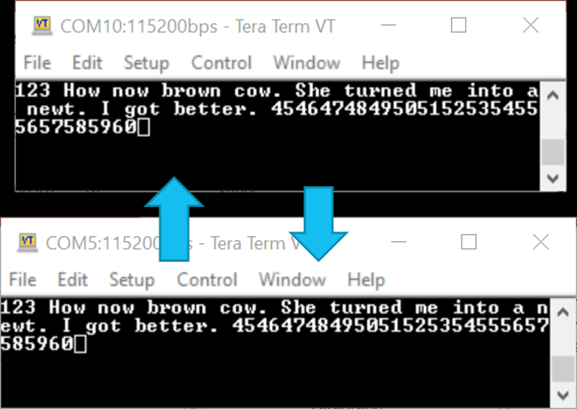
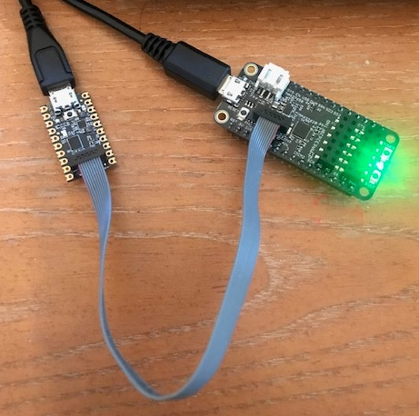
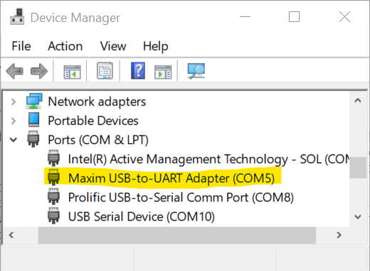

# MAX32620FTHR USB CDC ACM DEMO

## Introduction
The basic concept for the example firmware is to make the MAX32620FTHR (FTHR) board look like a USB-to-serial port (with plug and play capabilities) by implementing the USB CDC ACM protocol which requires no additional driver installation (except in Windows). So, the end result should work on multiple operating systems including Linux and MacOS.  The end-user will open two serial port terminals on the PC, one for "serial debug" of the FTHR, and one for the actual CDC-ACM serial port.  Then, typing in one terminal will echo back in the other.  See below for a screenshot of two serial port terminals opened.  COM5 is the CDC ACM serial port and COM10 is the console debug serial port on the MAX32620FTHR.

## Hardware Setup and Operation
The hardware setup is basically the typical setup of the MAX32620FTHR board with the Daplink debugger (MAX32625PICO) attached with a ribbon cable.  The FTHR and Daplink boards, of course, are connected to spare USB ports of a PC.  See below for an image of the typical setup.

After connecting the FTHR (with firmware loaded) to the PC through USB:
1. LED1 (green) should turn on once enumeration is complete.
2. The CDC-ACM COM driver should appear in the Windows "Device Manager" list of COM ports as 
"Maxim USB-to-UART Adapter (COMx)". Open a serial terminal to this COM port.
3. Open another serial terminal to the console UART of the MAX32620FTHR connected to the Daplink 
adapter, which is UART1 (TX = P2.1, RX = P2.0).
4. COM settings of the serial port terminals:  Speed = 115200, Data = 8-bit, Parity = none, stop bits = 1, 
Flow Control = none.
5. Typing characters in one serial terminal will echo in the other.

## Windows Device Driver Installation
The device driver installation script for Windows is included. It is digitally signed (the one in the kit may or may not be depending on the version).  This will allow for proper installation under Windows 10. To install, with the MAX32620FTHR unplugged from the USB port, simply right-click on the maxim_usb-uart_adapter.inf file and choose "install". Then, with the firmware loaded, plug the MAX32620FTHR board into a spare USB port.  To check if it was a successful install, look in the Windows "Device Manager".  See screenshot of a successful install below (with MAX32620FTHR plugged in).

## Source Code Project
The source code of this firmware project relies on the following:
- Installation of the Low Power ARM Micro SDK (Win). This provides the peripheral libraries and software development APIs, along with the compiler, debugger, and openocd tools.
- [Microsoft VSCode](https://code.visualstudio.com/download) with the [C/C++ plug-in](https://marketplace.visualstudio.com/items?itemName=ms-vscode.cpptools) installed. This makes for easy/quick compilations.  The project uses the VSCode-Maxim interface scripts, version 1.2.0. It is what interfaces VSCode to Maxim microcontrollers and allows the use of VSCode as the development IDE. A full user guide is located here:  [https://github.com/MaximIntegratedTechSupport/VSCode-Maxim](https://marketplace.visualstudio.com/items?itemName=ms-vscode.cpptools).