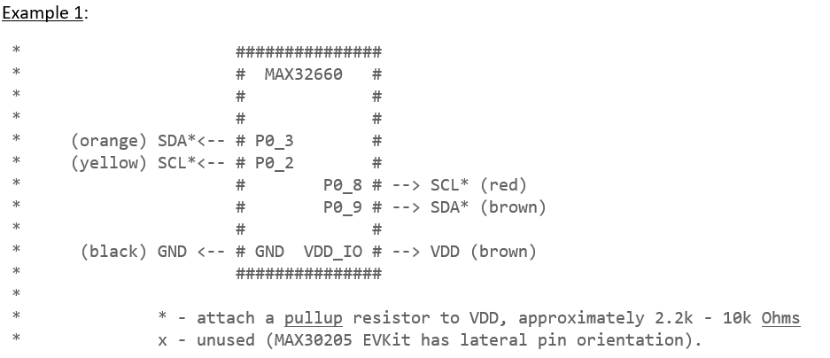
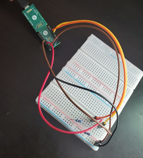
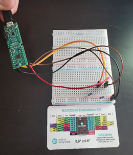
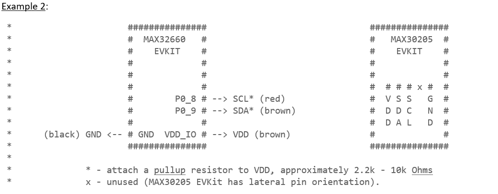
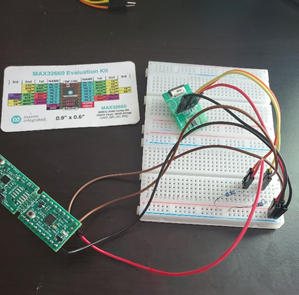
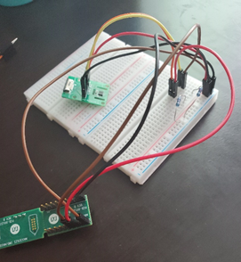

# I2C DMA Examples for MAX32660

The project was designed to show a basic software flow for using I2C with Direct Memory Access (DMA). Because DMA can be used in a wide variety of ways and for many different applications, this project is NOT intended to be an exhaustive look at how to use DMA with I2C. Rather, it intends to provide a springboard for designers getting started with this task based on some things one might have accomplished with standard I2C on the MAX32660.  This consists of two examples:

- The first example reads and writes to the MAX30205 temperature sensor using I2C DMA. It gets continuous temperature readings from the MAX30205 using a configurable delay between measurements, default to 1.5 seconds. It displays the temperature readings onto a serial terminal in Celsius and Fahrenheit.

- The second example reads and writes an arbitrary amount of data in a Loopback example following the format of the DMA Toolchain Example.

This project was designed using the Maxim ARM Toolchain in the Eclipse IDE (Release Neon.3 Ver. 4.6.3). In order to run either example, one should create a new project under their workspace in Eclipse. Go to File-->New-->Project and select the “Maxim Microcontrollers” wizard under C/C++. Name the project and select the workspace location, then click “Next”. Set the project configuration as below (the example type is not critical; it just selects a template for the code):

After clicking “Finish”, copy the main.c from the example you want to run (either the Loopback example or the MAX30205 example) and replace the main.c template generated by Eclipse. Connect the hardware as detailed below and select Debug-->Debug Configurations and select your project’s name from the list. The example should debug correctly and, assuming the hardware is properly connected, yield accurate results.

The hardware connections for each example are depicted in wiring diagrams within the code, reprinted along with the colors of their jumper cables shown in the pictures below:

 

The colors of the wires for the MAX30205 in the pictures to follow are:
- VDD: Red
- SDA: Orange
- SCL: Yellow
- GND: Black

 

*The designer used 2.2 kiloohm pullup resistors for the circuits shown.

The project contained in this repository contains a project designed to show a basic software flow for using I2C with Direct Memory Access (DMA). Because DMA can be used in a wide variety of ways and for many different applications, this project is NOT intended to be an exhaustive look at how to use DMA with I2C. Rather, it intends to provide a springboard for designers getting started with this task based on some things one might have accomplished with standard I2C on the MAX32660. 

The list below outlines a general procedure for using I2C with DMA:
1.	Initialize the I2C module intended to be used. 
    - Enable DMA on the I2C module through the DMA register.
    - Set the Master Mode Enable bit on the Control 0 register.
    - Set the TX FIFO and RX FIFO thresholds to 1 to trigger DMA transactions on threshold interrupts.
    - If reading, set the amount of bytes you intend to receive (maximum is 256) on the I2C module’s RX Control 1 register in the “rxcnt” field.
2.	Configure the DMA channels intended to be used.
    - Set the Request Select (reqsel) parameter to DMA_REQSEL_I2C0TX or to DMA_REQSEL_I2C0RX macros, depending on which buffer the channel is supposed to connect to.
    - Set the DMA source and destination widths to DMA_WIDTH_BYTE to avoid overflow/underflow on the target buffers or arrays. Set the Burst Size to 1 for the same reason.
    - Set the source increment enable to 1 if writing, set the destination increment enable to 1 if reading. Whichever address (source or destination) is connected to an I2C buffer should NOT be increment enabled. 
    - Enable Interrupts on each DMA channel, if you intend to use them (optional).
3.	Set the Source, Destination, and Count registers for the DMA channels being used. 
    - If the channel is connected to a TX FIFO, the destination address will be ignored.
    - If the channel is connected to an RX FIFO, the source address will be ignored.
    - Set the count to the size of the data array you intend to send or receive.
4. Load the FIFO with a slave address. If writing, you should do this before you start the DMA TX channel. If reading, it can be done afterwards.
5.	Start the DMA Channels you intend to use.
6.	Send a Start bit on the I2C bus manually by setting the start bit on the module’s Master Control register.
7.	Set the Stop bit on the Master Control register to generate a Stop bit when the transaction has finished. This bit will reset when a Stop condition is generated on the I2C bus and can be polled to determine when an I2C transaction has been completed.

Note: Having both DMA channels active is not required for the I2C transfers to work; only one channel needs to be active to move date to/from the buffer of interest. In other words, only a tx channel is needed for write-only transactions and only an rx channel is needed for read-only transactions.
